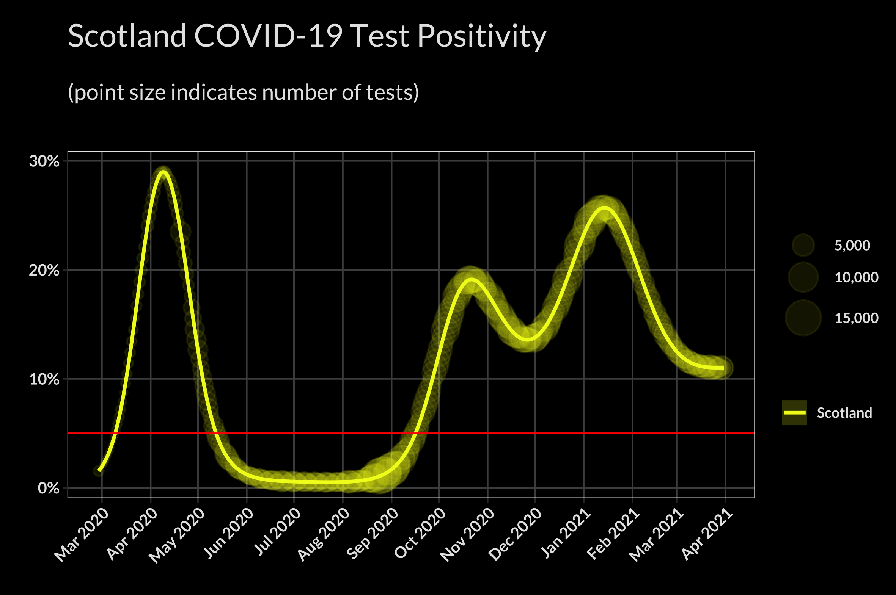
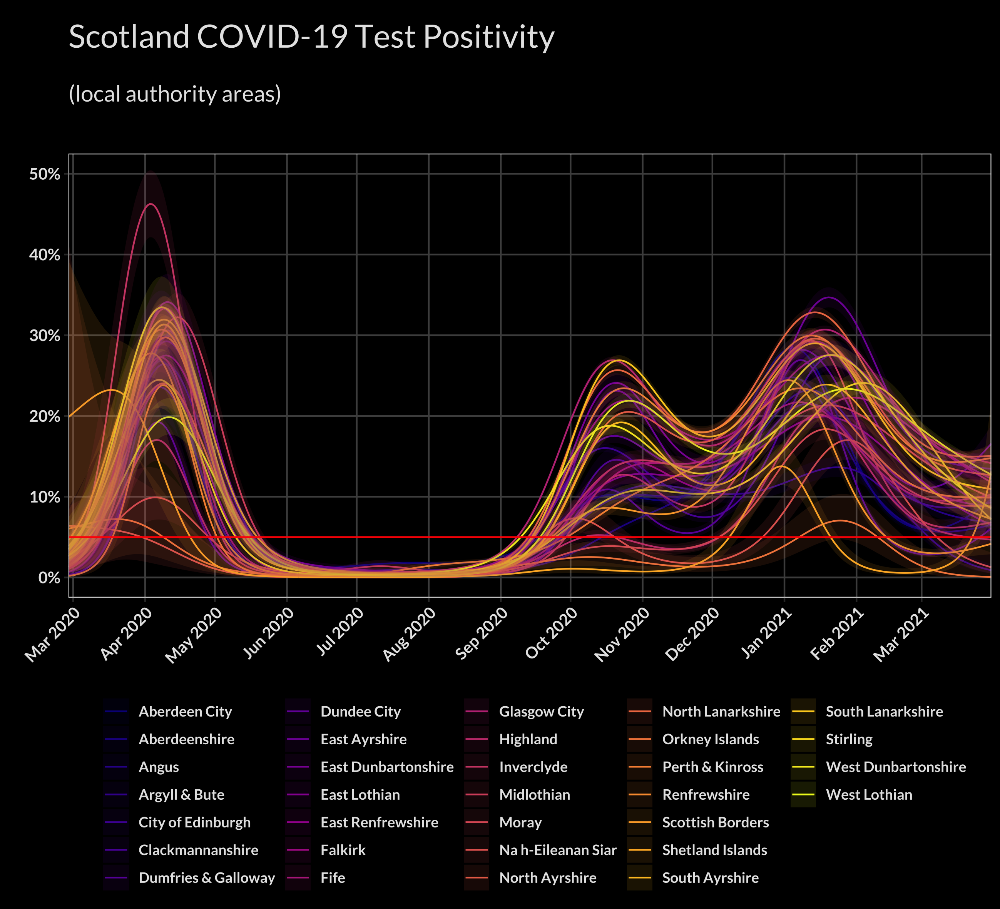
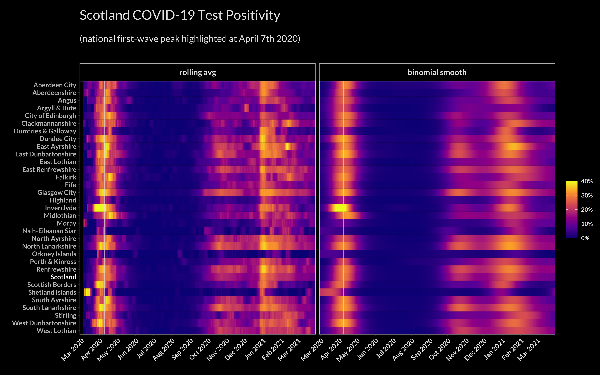
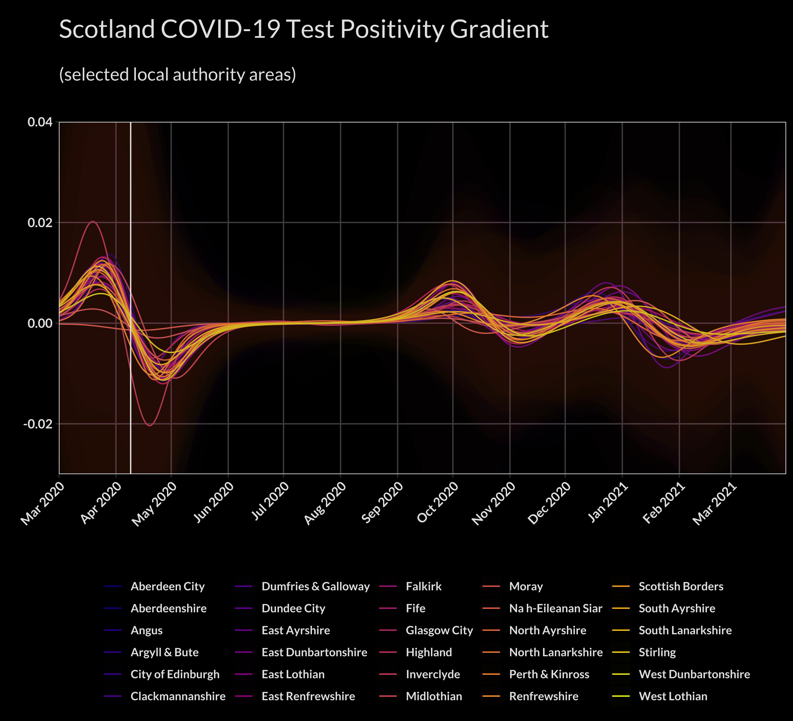

# covid_positivity

A look at using test positivity (i.e. percentage of tests taken that were positive) instead of crude case numbers.

## Animated Maps
Shows how the (daily) test positivity of the different council areas changed over time.

### First Wave
Firstly from the start of the data, up until June, i.e. the first wave...

### Second Wave
And also from the start of August until the present date -- i.e. what looks to be the second wave.

## Test Positivity
Comparing the test positivity from a rolling seven-day average, to that taken from a fitted binomial smooth model...

### Scotland Test Positivity
Here the test positivity represented by dots are the seven-day rolling values, where the point size represents the number of tests (note the increase in dot size when the schools returned in August for instance). The binomial smooth is represented by the solid line, with a 95% confidence interval also shown as a (thin) ribbon.

### Local Authority Test Positivity
As above, but for all the council areas, and without the rolling average data shown.

## Heatmaps
Essentially same data as the animated maps above, but shown as linear strips so all the data is visible at the same time. When looking at the respective area's peaks, we can see that there is a spread of about two weeks over the country.

### Local Authority Heatmaps
Here, the council areas are shown alphabetically...

...and here they are ordered according to the date of their first-wave peak.

## Test Positivity Gradient
Looking at the gradient of the test positivity curve we can see which areas e.g. peaked *faster* or tailed off *slower* etc.

### Scotland Test Positivity Gradient

### Local Authority Test Positivity Gradient

