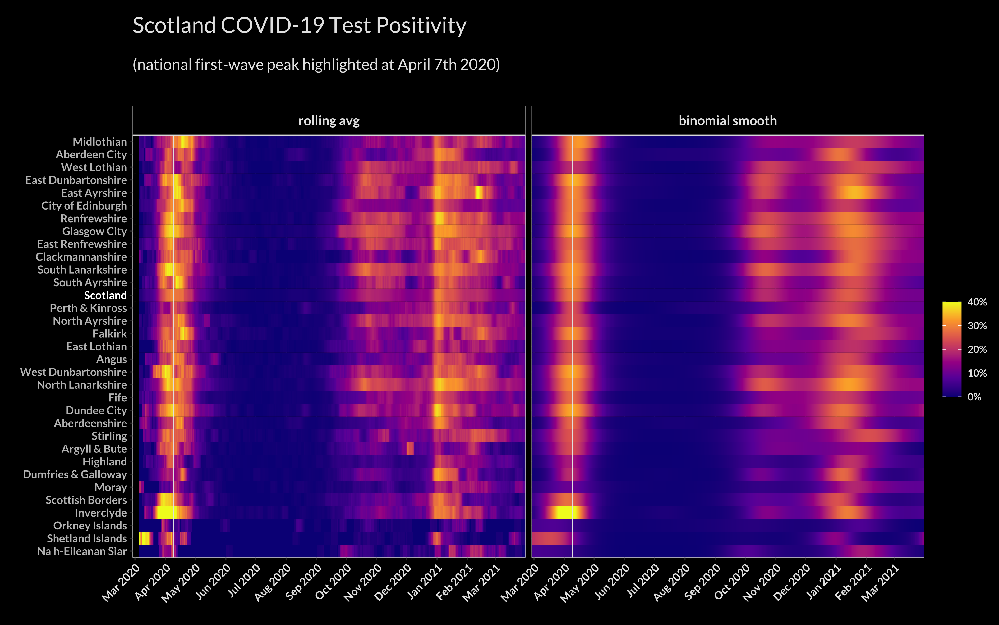
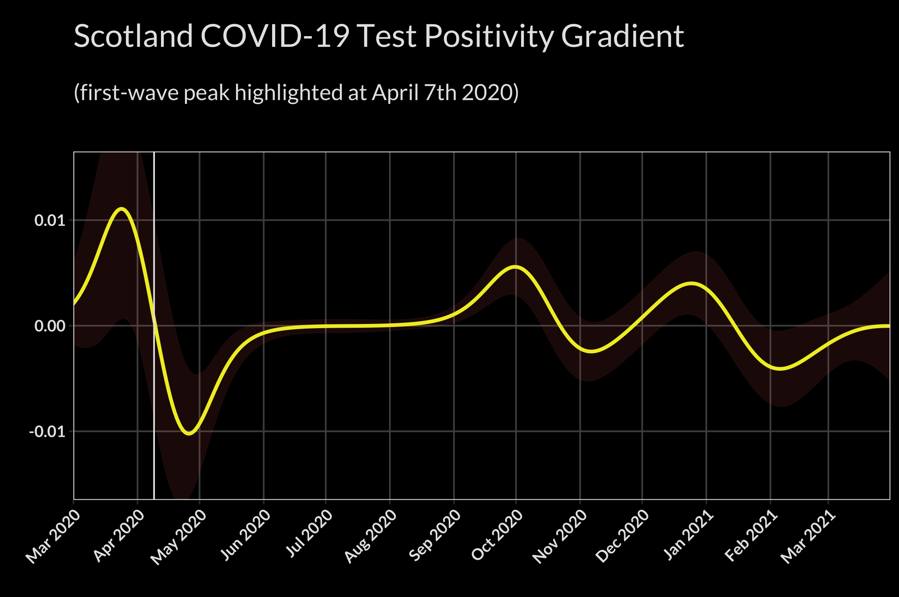
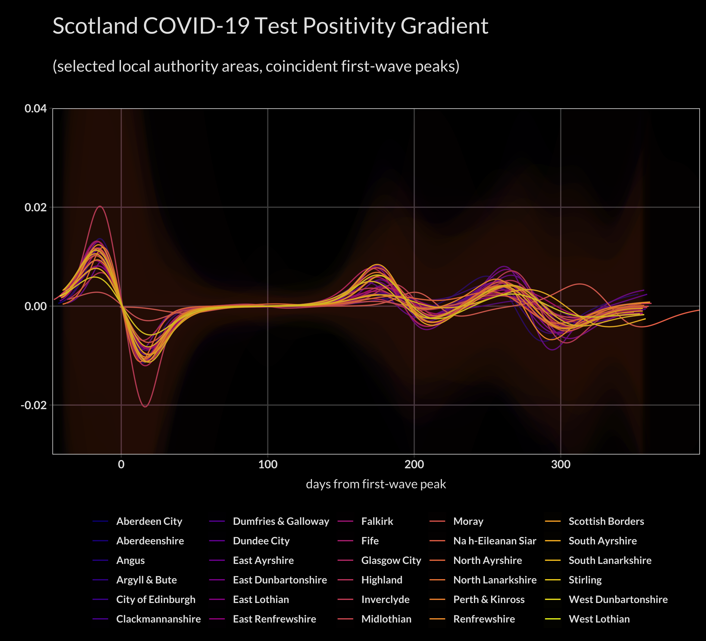

# covid_positivity

A look at using test positivity (i.e. percentage of tests taken that were positive) instead of crude case numbers.

## Animated Maps

### First Wave

### Second Wave

## Test Positivity

### Scotland Test Positivity

### Local Authority Test Positivity

## Heatmaps

### Local Authority Heatmaps

## Test Positivity Gradient

### Scotland Test Positivity Gradient

### Local Authority Test Positivity Gradient

